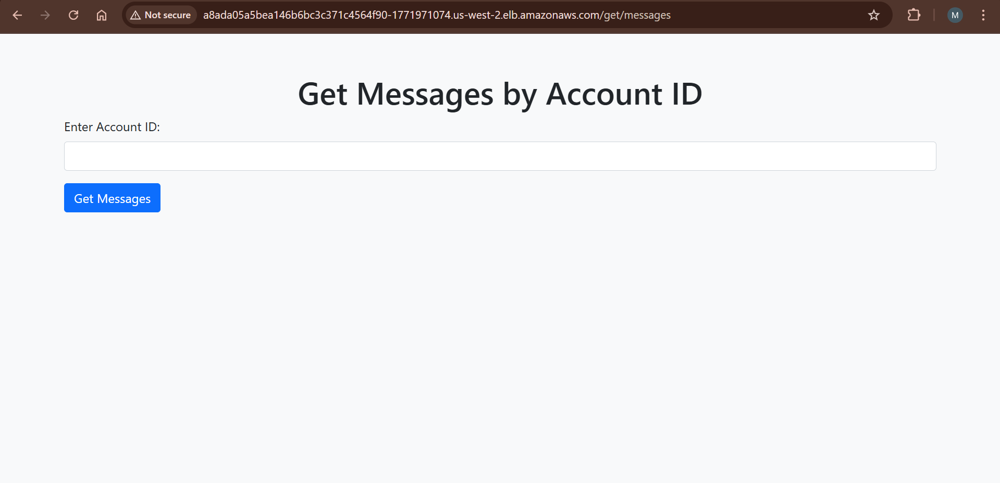
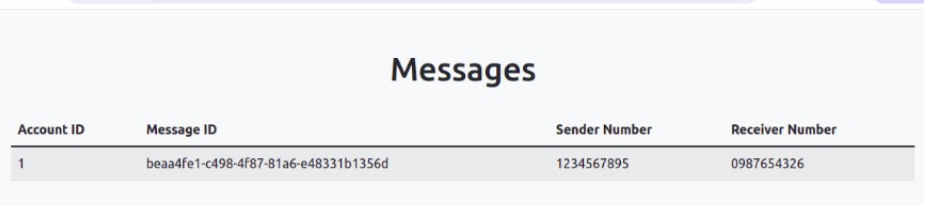
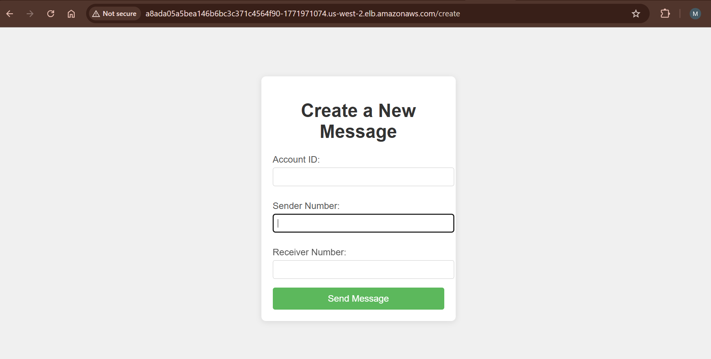
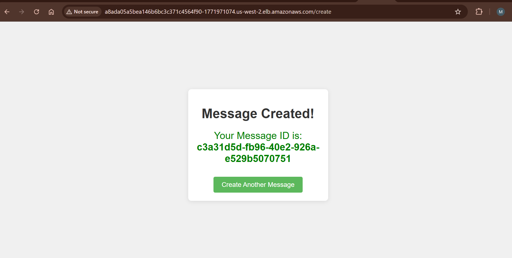
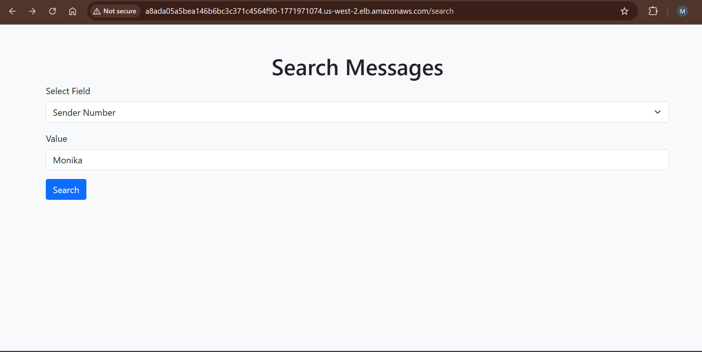
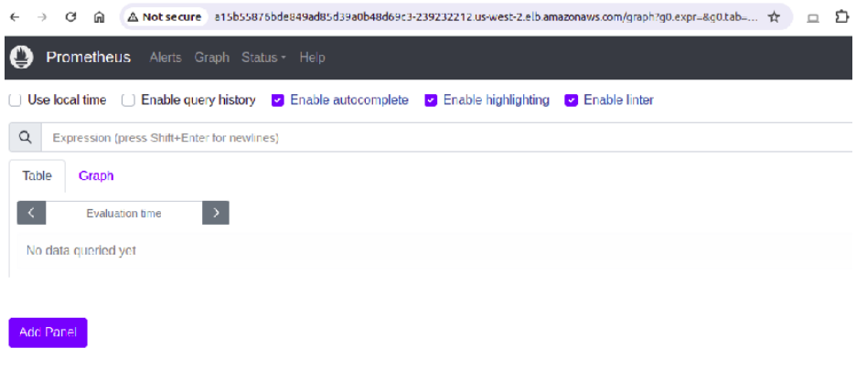
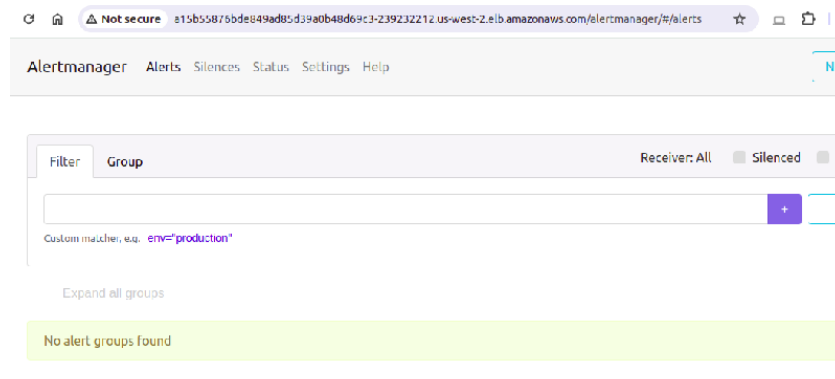

#  Message Application on AWS EKS using Terraform, Docker & Helm

This project demonstrates the end-to-end deployment of a Flask-based Message Application on Amazon EKS. The infrastructure is provisioned using Terraform, the application is containerized with Docker, deployed using Helm, and monitored with Prometheus and Alertmanager (with Slack/email integration). NGINX ingress is used to expose the service externally.

 Built from scratch, this project reflects hands-on experience in deploying microservices on Kubernetes using modern DevOps tools and best practices.

---

## Application Preview

###  Get Message Form
> `http://<ingress-host>/get/messages`



---

###  Get Message Output
> `http://<ingress-host>/get/messages/<account_id>`



---

### Create Message Form
> `http://<ingress-host>/create`



---

###  Create Message Output
> After form submission



---

###  Search Message Form & Result
> `http://<ingress-host>/search`



---

###  Prometheus Dashboard
> `http://<ingress-host>/prometheus`



---

###  Alertmanager Dashboard
> `http://<ingress-host>/alertmanager`



---

##  Project Highlights

-  **Infrastructure-as-Code (IaC)** with Terraform to provision EKS cluster, VPC, subnets, IAM roles
-  **Dockerized Flask App** connected to a PostgreSQL database
- **Helm-based deployment** for the app and DB with health checks, secrets, autoscaling, PVCs
- **NGINX Ingress Controller** to expose multiple HTTP routes
-  **Prometheus & Alertmanager** with Slack/email alerting for application and infrastructure monitoring
- Secrets and ConfigMaps to secure environment variables and DB credentials

---

## Tech Stack

| Category           | Tools Used                                                                 |
|-------------------|------------------------------------------------------------------------------|
| Cloud Platform     | AWS EKS, ECR, IAM, VPC                                                      |
| Infrastructure     | Terraform                                                                   |
| Containers         | Docker                                                                      |
| Orchestration      | Kubernetes                                                                  |
| Package Manager    | Helm                                                                        |
| Web Framework      | Python (Flask)                                                              |
| Database           | PostgreSQL (StatefulSet + PVC)                                              |
| Ingress            | NGINX Ingress Controller                                                    |
| Monitoring         | Prometheus, Alertmanager                                                    |
| Alerting           | Slack, Email (Alertmanager receivers)                                       |

---

##  How to Deploy This Project

You need: AWS credentials, Docker, kubectl, Terraform, Helm installed and configured.

---

### 1. Provision EKS Cluster using Terraform
```bash
cd message_application/terraform/
```
Update variables.tf with your AWS region (e.g. us-east-1)

Update terraform.tfvars with your aws_access_key and aws_secret_key

Then run:

terraform init
terraform plan
terraform apply


 This creates the EKS cluster, VPC, public subnets, node group, security groups, and IAM roles.

To destroy the cluster later:

 terraform destroy

### 2. Configure kubectl to Connect to EKS
    aws eks update-kubeconfig --name my-eks-cluster --region <your-region>

### 3. Build and Tag Docker Image
```cd message-image/ ```
``` docker build -t message/message_service:latest . ```

### 4️. Push Image to AWS ECR
# Authenticate Docker to ECR
```aws ecr get-login-password --region <region> | docker login --username AWS --password-stdin <account-id>.dkr.ecr.<region>.amazonaws.com ```

# Tag the image
```docker tag message/message_service:latest <account-id>.dkr.ecr.<region>.amazonaws.com/message-service:latest```

# Create repo if not done already
```aws ecr create-repository --repository-name message-service --region <region>```

# Push the image
```docker push <account-id>.dkr.ecr.<region>.amazonaws.com/message-service:latest```

### 5. Deploy Application using Helm
```cd message_application/messageapp/```

```helm upgrade --install -n message --create-namespace message messageapp/ \ ```
```  --set message.image="<account-id>.dkr.ecr.<region>.amazonaws.com/message-service" \ ```
```  --set message.tag="latest" ```


Includes: Flask app, PostgreSQL StatefulSet, secrets, autoscaling, and volumes

### 6. Set Up Ingress Controller
```kubectl apply -f message_application/ingress-controller.yaml```


Get the Ingress Hostname:

```kubectl get ingress -A | grep message-service-ingress | awk '{print $5}'```


Access Application URLs:

http://<hostname>/get/messages

http://<hostname>/create

http://<hostname>/search

### 7️. Install Prometheus
```cd message_application/ ```
```helm upgrade --install prometheus -n prom --create-namespace prometheus/```


Get Prometheus URL:

```kubectl get ingress -A | grep prometheus-ingress | awk '{print $5}'```

### 8️. Install Alertmanager
```helm upgrade --install alertmanager -n prom --create-namespace alertmanager/```


Get Alertmanager URL:

```kubectl get ingress -A | grep alertmanager-ingress | awk '{print $5}'```


 Slack and email alert receivers are preconfigured in alertmanager/ Helm chart.

 Application Structure
message_application/
├── terraform/                 # EKS Infra setup
├── messageapp/                # Helm chart for Flask app + DB
├── ingress-controller.yaml    # NGINX ingress controller config
├── alertmanager/              # Helm chart for Alertmanager
├── prometheus/                # Helm chart for Prometheus
message-image/
├── app.py                     # Flask app code
├── requirements.txt           # Python dependencies
├── Dockerfile                 # Image build file

 Why This Project is Valuable ?

This project simulates a real-world DevOps workflow by covering:

Infrastructure provisioning (IaC)
Containerization & registry integration
Kubernetes-based deployments using Helm
Monitoring and alerting stack integration
Secure deployments with Secrets and Ingress routing

By completing this project, I gained practical experience in:

Designing scalable infrastructure on AWS

 Handling Helm chart templating

Configuring Kubernetes networking and persistent storage

Integrating observability into microservices

 Using Terraform to manage infrastructure lifecycles

Author : Monika Kumari
LinkedIn: https://www.linkedin.com/in/monika-kumari-a5a209201/
